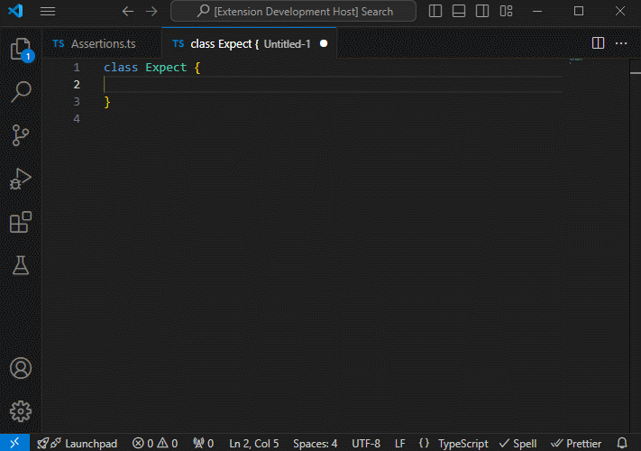
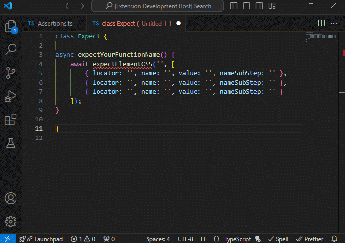

# QA Playwright Assertions Helper

Расширение направлено на помощь QA инженерам в написании АТ сценариев

### Возможности расширения
---
### `Создание шаблона ожиданий`

Команда `Playwright. Expect template` отображает список `LocatorAssertions` по официальной документации playwright

Выбирая нужный `expect` можно задать любое количество ожиданий в шаблоне
> P.S. Если ничего не выбрано, по умолчанию выбирается значение один

После выбора нужного ожидания и количество строк, генерируется шаблон, в который останется подставить нужные данные

---
### `Переход в официальную документацию`

Команда `Playwright. Expect documentation` так же отображает список с `LocatorAssertions`, но в отличии от первой команды, при выборе нужного ожидания пользователя перенаправит на официальный сайт с документацией

---
### `Создание функции, для работы шаблонов ожиданий`

Команда `Playwright. Generate expect function` нужна для генерации шаблона функций, которые мы используем в дальнейшем в тестах

Для того что бы вызвать команду нужно создать файл с названием `Assertions.ts` в директории проекта

После нужно перейти в созданный файл и вызвать команду `Playwright. Generate expect function`

> P.S. Если вы используете версию Playwright 1.44 и выше, то вам нужно разкомитить последние три функции `expectElementToHaveAccessibleDescription`, `expectElementToHaveAccessibleName`, `expectElementToHaveRole`
